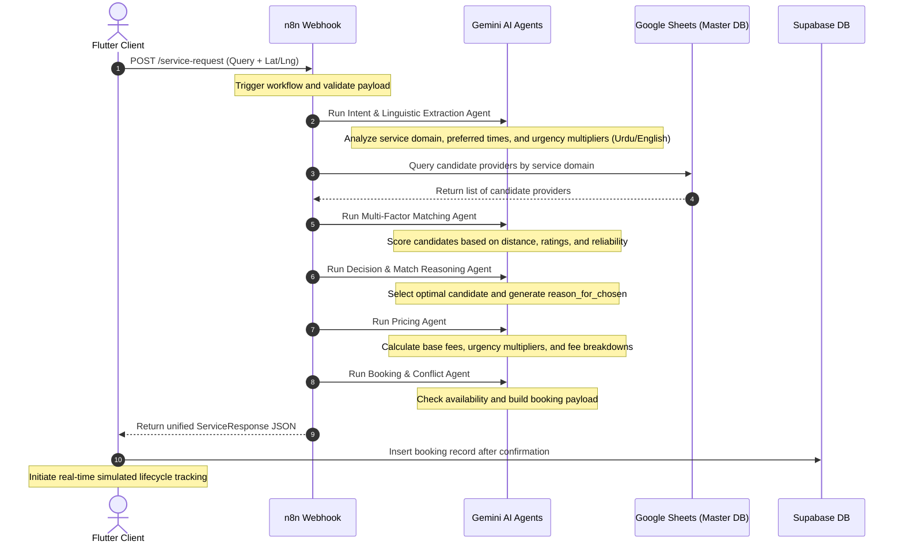

# 🚀 SERVIQ

<div align="center">
  

  <h3><b>AI-Powered Local Service Orchestrator</b></h3>
  <p>An intelligent, agentic matching and booking engine interpreting natural language queries to seamlessly connect users with highly-optimized local service experts.</p>

  <p align="center">
    
    
    
    
    
  </p>
</div>

---

## 🎯 Value Proposition

Traditional local service matching relies on static online directories, tedious manual search forms, and arbitrary reviews. **Serviq** introduces a **natural language first, AI-orchestrated paradigm**. 

By parsing conversational Urdu or English service queries (e.g., *"Mujhe kal AC repair chahiye"* or *"i need a plumber in green town around 3am"*), Serviq automatically resolves user intent, tracks localized GPS coordinates, evaluates 50+ service candidates via multi-factor matching algorithms, and returns a tailored provider recommendation complete with transparent, AI-synthesized matching explanations. 

All this is wrapped in a highly-animated, premium custom design system optimized for perceived performance and real-time step tracking.

---

## 🧠 Multi-Agent Orchestration Architecture

Serviq separates core cognitive domains into five distinct AI agents running asynchronously inside an **n8n** webhook-driven workflow:



---

## ✨ Features & Capabilities

* **🗣️ Bilingual Semantic Input**: Advanced comprehension of unstructured English and Urdu queries including phonetic spellings, regional expressions, and contextual time reference markers.
* **🎙️ Cross-Platform Speech Recognition**: Fully integrated voice-to-text module leveraging mobile-native `speech_to_text` engines and native HTML5 `SpeechRecognition` APIs for web builds, allowing seamless voice inputs across both platforms.
* **📍 Live Location Capture**: Enforces mandatory GPS coordinate resolution before processing, mapping distances in real time for precise local provider scoring.
* **🤖 Multi-Agent Logic Engine**: Leverages five specialized LLM agents working sequentially:
  * **Intent Agent**: Identifies service type, maps it to Google Place category, and sets urgency factors.
  * **Matching Agent**: Filters and scores candidate pools by geographic distance and historical ratings.
  * **Decision Agent**: Selects the premier professional and creates a personalized matching summary.
  * **Pricing Agent**: Dynamically generates price breakdowns matching the matched provider's base fee.
  * **Booking Agent**: Confirms calendar availability, formatting final payloads.
* **💬 Transparent AI Explanations**: Surfaces clear "Match Reasoning" directly on provider cards, outlining why each candidate was selected or rejected.
* **🧾 Pricing Breakdown Engine**: Transparent, dynamic line-item breakdowns comprising base fees, distance rates, platform costs, and urgency surcharges.
* **⏳ Simulated Lifecycle Tracker**: Interactive real-time tracker following a 5-step status stepper (Confirmed ➔ En Route ➔ Arrived ➔ Working ➔ Completed) with progress indications.
* **🔒 Supabase Data Sync**: Real-time synchronization of bookings and historical logs with Supabase backend tables.

---

## 🛠️ Technical Stack & Dependencies

### Frontend (Flutter Client)
* **State Management**: [Riverpod (AsyncNotifier)](https://pub.dev/packages/flutter_riverpod) for reactive, thread-safe asynchronous API state loops.
* **Voice Processing**: [speech_to_text](https://pub.dev/packages/speech_to_text) (v7.3.0) for native iOS/Android transcription, with conditional fallback to HTML `SpeechRecognition` for web platforms.
* **Routing System**: [GoRouter](https://pub.dev/packages/go_router) with redirection guards mapping sessions and deep navigation.
* **Animations**: [Flutter Animate](https://pub.dev/packages/flutter_animate) for micro-animations, [Lottie](https://pub.dev/packages/lottie) for vector loading indicators, and [Shimmer](https://pub.dev/packages/shimmer) for skeleton placeholders.
* **HTTP Client**: [Dio](https://pub.dev/packages/dio) with global timeout configurations for fail-safe agent polling.
* **Location Systems**: [Geolocator](https://pub.dev/packages/geolocator) for highly precise real-time hardware location requests.
* **Database & Persistence**: [Supabase Flutter SDK](https://pub.dev/packages/supabase_flutter) to register and cache confirmed bookings.

### Backend & Core APIs
* **Orchestration**: n8n Webhook Workflow (Hosted on Railway).
* **AI Cognitive Unit**: Google Gemini 1.5 Flash API.
* **Database (Primary Master)**: Google Sheets (Dynamic provider indexing).

---

## 🧱 Scale-Ready Folder Structure

The project implements a clean, feature-first modular architecture adhering strictly to Domain-Driven Design (DDD) principles:

```text
lib/
├── main.dart                      # App initialization & Supabase/Riverpod configurations
├── core/                          # Global shared core layer
│   ├── constants/                 # Core spacing, dimensions, assets, and key constants
│   ├── network/                   # Central Dio API client config
│   ├── router/                    # GoRouter declarations and navigation shell routers
│   ├── theme/                     # AppTheme configuration & Cyprus/Sand color codes
│   ├── utils/                     # Validators, formatters, and helper classes
│   └── widgets/                   # Premium shared components (cards, text fields, loaders)
└── features/                      # Isolated feature modules
    ├── auth/                      # Authentication screen, user models, & Supabase providers
    ├── booking/                   # Pricing screens, booking confirmations, & history UI
    ├── common/                    # Shared profiles and domain models (e.g. BookingModel)
    ├── input/                     # NLP Input page, repository abstractions, & Riverpod notifier
    ├── matching/                  # AI matching states & dynamic provider list interface
    ├── splash/                    # Perceived progress splash screen
    └── tracking/                  # Real-time lifecycle step tracker and rating sheets
```

---

## 🎨 Premium Cyprus & Sand Design System

The application layout is built upon a highly custom, minimal design language combining organic color palettes with vibrant micro-interactions:

| Token | Hex Value | Application |
| :--- | :--- | :--- |
| **Primary (Cyprus)** | `#004643` | Main buttons, active state highlights, primary brand identity |
| **Background (Sand)** | `#F0EDE5` | Clean organic page backgrounds |
| **Accent (Mustard)** | `#F9BC60` | Five-star ratings, premium indicators, active badges |
| **Surface (White)** | `#FFFFFF` | Core premium cards and interactive inputs |
| **Text Primary** | `#1A1C1B` | High contrast primary reading typography |
| **Typography** | *Inter* & *Plus Jakarta Sans* | Premium typographic readability |

---

## 🔌 API Reference & Webhook Contract

### 1. Match Request Endpoint
* **Method**: `POST`
* **Endpoint**: `https://n8n-production-b9127.up.railway.app/webhook/service-request`
* **Body Type**: `application/json`

#### Request Payload Schema
```json
{
  "query": "i need a plumber in green town around 3am",
  "test": false,
  "latitude": 31.568490,
  "longitude": 74.291660
}
```

#### Successful Match Response (`ServiceResponse`)
```json
{
  "success": true,
  "count": 3,
  "providers": [
    {
      "id": "ChIJudHcgsz_GDkRvoJWQF01XD4",
      "name": "Electrical Solutions",
      "service_type": "service",
      "rating": 4.9,
      "reviews": 115,
      "phone": "0314 7542749",
      "address": "Shop#7 Al fazal market AA Block, Bahria Town, Lahore, Pakistan",
      "location": {
        "lat": 31.3764568,
        "lng": 74.169971
      },
      "maps_url": "https://maps.google.com/?cid=4493525202836554430",
      "website": "https://eselectrician.com/",
      "reason_for_chosen": {
        "text": "One of the best electrician services in Bahria Town, arriving in 5 minutes and resolving the AC fault.",
        "languageCode": "en"
      }
    }
  ],
  "intent": {
    "service": "plumbing",
    "google_place_type": "plumber",
    "urgency": "high",
    "urgency_multiplier": 1.25,
    "confidence": 0.95,
    "preferred_time": "3:00 AM",
    "notes": null
  }
}
```

---

## ⚡ Quick Start

Ensure you have the Flutter SDK installed on your system.

```dart
import 'package:dio/dio.dart';
import 'package:serviq/features/input/data/repositories/service_repository.dart';

final repo = ServiceRepositoryImpl(Dio());
final response = await repo.requestService("plumber near bahria town", lat: 31.368, lng: 74.186);
print("Matched: ${response.providers.first.name}");
```

---

## 🚀 Installation & Local Environment Setup

### 1. Clone the Codebase
```bash
git clone https://github.com/your-username/serviq.git
cd serviq
```

### 2. Configure Supabase Schema
Before compiling the client, initialize the database tables inside your Supabase SQL editor:
```sql
CREATE TABLE "Bookings" (
  id uuid DEFAULT gen_random_uuid() PRIMARY KEY,
  user_id uuid REFERENCES auth.users(id),
  status text NOT NULL DEFAULT 'confirmed',
  service_type text NOT NULL,
  provider_name text NOT NULL,
  total_price numeric NOT NULL,
  address text,
  created_at timestamp with time zone DEFAULT now() NOT NULL
);

-- Enable Realtime for live updates on the tracking stepper
ALTER PUBLICATION supabase_realtime ADD TABLE "Bookings";
```

### 3. Install Client Dependencies & Run
```bash
# Fetch required packages
flutter pub get

# Generate static freezed & riverpod files
flutter pub run build_runner build --delete-conflicting-outputs

# Execute code analysis to verify strict lint rules
flutter analyze

# Compile and start project on your current emulator
flutter run
```

---

## ⚠️ Troubleshooting & Fail-Safe Modes

### 📍 Error: Location Service Required (`LOCATION_REQUIRED`)
* **Problem**: Serviq requires high-fidelity coordinates to compute provider matches; if denied, request triggers a location warning block.
* **Fix**: Ensure GPS toggle is enabled on your device. On iOS/Android, grant the application "While Using the App" location permissions in settings.

### ⏱️ Error: Network Connection Timeout / Processing Hangs
* **Problem**: Under heavy n8n/Gemini server loads, API requests might run longer than normal, causing state hangs.
* **Built-in Fix**: The application's network repository utilizes a strict 30-second Dio connect/send timeout. Additionally, the AI Progress Screen contains a 60-second watchdog dialog letting users return back safely to `/home` if agents become unresponsive.

---

## 🤝 Contributing

We welcome contributions to Serviq. Please read our contributing guide to submit bug reports, suggest feature modifications, or submit pull requests.

1. Fork the Project.
2. Create your Feature Branch (`git checkout -b feature/NewCapability`).
3. Commit your Changes (`git commit -m 'Add NewCapability'`).
4. Push to the Branch (`git push origin feature/NewCapability`).
5. Open a Pull Request.

---
