# ⚙️ Project Implementation Roadmap

## 📌 Roadmap Metadata
* **Document Version**: 1.1.0
* **Date**: May 2026
* **Status**: Main Phases Complete / Deployment-Ready

---

## 🏆 Current Status Overview

Serviq has successfully transitioned from an initial prototype to a **production-ready frontend client** integrated with an asynchronous n8n multi-agent webhook pipeline and Supabase backend services. The core project is fully functional, lint-free, and supported by future-proof CI/CD pipelines.

---

## 📅 Multi-Phase Engineering Timeline

```mermaid
flowchart LR
    classDef complete fill:#e6f4ea,stroke:#137333,stroke-width:2px,color:#137333;
    classDef active fill:#fef7e0,stroke:#b06000,stroke-width:2px,color:#b06000;
    classDef future fill:#f1f3f4,stroke:#5f6368,stroke-width:1px,color:#5f6368;

    p1["🟢 Phase 1: Core Foundation<br>(May 10 - May 12)"]:::complete
    p2["🟢 Phase 2: AI Orchestration<br>(May 13 - May 14)"]:::complete
    p3["🟢 Phase 3: Lifecycle Sync<br>(May 15 - May 16)"]:::complete
    p4["🟢 Phase 4: CI/CD Setup<br>(May 17 - May 18)"]:::complete
    p5["🟢 Phase 5: Voice & NLP<br>(May 19 - May 22)"]:::complete
    p6["🟡 Phase 6: WebSockets & GPS<br>(May 23 - May 28)"]:::active
    p7["⚪ Phase 7: Payment Gateways<br>(June 01 - June 07)"]:::future

    p1 --> p2 --> p3 --> p4 --> p5 --> p6 --> p7
```

---

## 🚀 Completed Phases

### 🟩 Phase 1: Foundation & Custom UI Design (Complete)
* **Milestones**:
  * Established modular directory structures separating presentation, domain, and data layers.
  * Configured the [GoRouter](./lib/core/router/app_router.dart) system with redirect guards protecting home routes.
  * Designed [AppTheme](./lib/core/theme/app_theme.dart) centralizing Cyprus `#004643` and Sand `#F0EDE5` tokens.
  * Built reusable custom components ([PremiumCard](./lib/core/widgets/premium_widgets.dart#L6), [PremiumButton](./lib/core/widgets/premium_widgets.dart#L52), [PremiumTextField](./lib/core/widgets/premium_widgets.dart#L196)).

### 🟩 Phase 2: NLP Input & AI Agent Orchestration (Complete)
* **Milestones**:
  * Configured the [Dio network layer](./lib/features/input/data/repositories/service_repository.dart#L62-L69) with robust 30-second connection and transmission timeouts.
  * Connected client queries with the n8n Multi-Agent webhook pipeline.
  * Integrated [LocationService](./lib/core/services/location_service.dart) to capture precise user coordinates.
  * Developed the Perceived Performance loading screen ([AIUnderstandingScreen](./lib/features/matching/presentation/screens/ai_understanding_screen.dart)) with active processing watchdogs.

### 🟩 Phase 3: Simulated Lifecycle & Data Sync (Complete)
* **Milestones**:
  * Developed the [StatusStepper](./lib/features/tracking/presentation/widgets/status_stepper.dart) vertical stepper tracking real-time status transitions.
  * Enabled user authentication and persistent logging inside Supabase schemas.
  * Programmed real-time progress simulation timers inside [TrackingNotifier](./lib/features/tracking/presentation/providers/tracking_provider.dart).

### 🟩 Phase 4: Production Deployment & CI/CD Pipeline (Complete)
* **Milestones**:
  * Programmed `.github/workflows/build-and-release.yml` executing automated lints, tests, and compilations.
  * Enabled automated GitHub Pages deployment for instantaneous web previews.
  * Automated GitHub Releases publishing compiled Android APK assets.

### 🟩 Phase 5: Voice Processing & NLP Enhancement (Complete)
* **Milestones**:
  * Created the abstracted [AppSpeechHelper](./lib/core/utils/speech_helper.dart) layer separating platform speech logic.
  * Programmed [MobileSpeechHelper](./lib/core/utils/speech_helper_mobile.dart) leveraging mobile-native `speech_to_text` engines.
  * Integrated [WebSpeechHelper](./lib/core/utils/speech_helper_web.dart) natively tapping Chrome/Safari browser `html.SpeechRecognition` APIs to bypass plugin failures on web compile.
  * Redesigned the NLP prompt space in [InputScreen](./lib/features/input/presentation/screens/input_screen.dart) to offer inline toggling, audio wave listening indicators, and microphone input streams.

---

## 📈 Future Scale Targets

### 🔮 Phase 6: Live WebSockets & GPS Tracking (Active)
* **Objectives**:
  * Replace the simulated timer inside `TrackingNotifier` with a persistent websocket channel.
  * Bind the `TrackingScreen` to a live Geolocator stream updating a geographic Google Map interface as a real technician moves closer.

### 🔮 Phase 7: Real-world Payment Gateways
* **Objectives**:
  * Integrate local secure payment gateways (e.g. Nayapay, Sadapay, Stripe) to process transaction settlements.
  * Establish multi-party escrow logic holding customer funds until technician checks in complete step validations.
